## 🖼️ App Previews
Here are some screenshots showcasing the features and UI of **Weeabooify** ✨  
You can explore how the app looks across different menus, settings, and overall design.

<!-- Row 1 -->
<table>
  <tr>
    <td>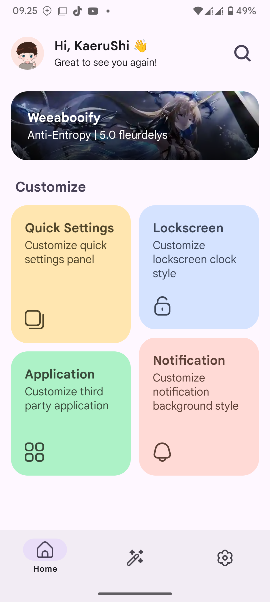</td>
    <td>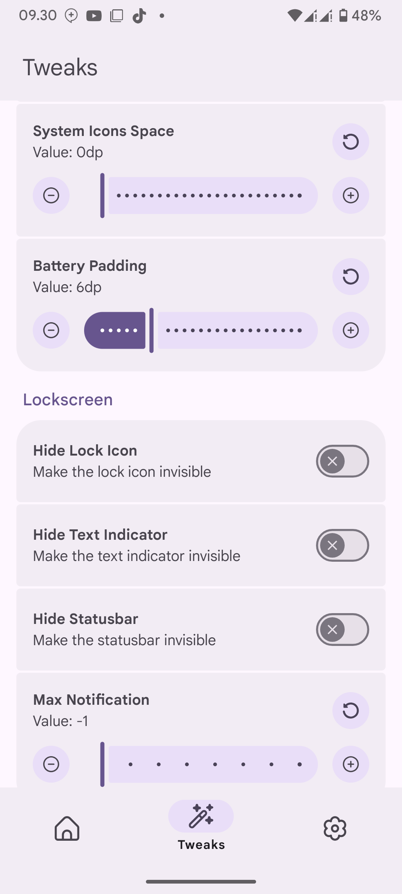</td>
    <td>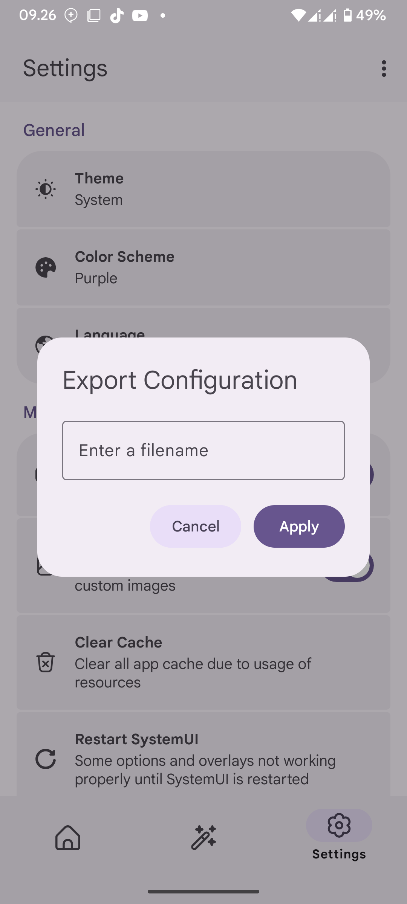</td>
    <td>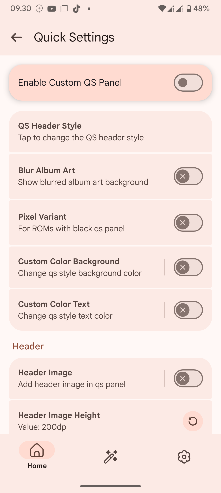</td>
  </tr>
</table>

<!-- Row 2 -->
<table>
  <tr>
    <td>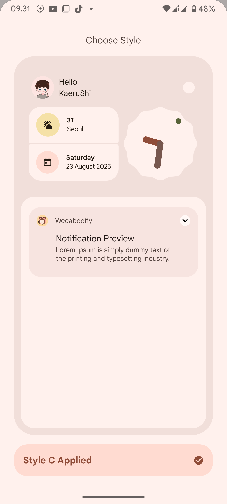</td>
    <td>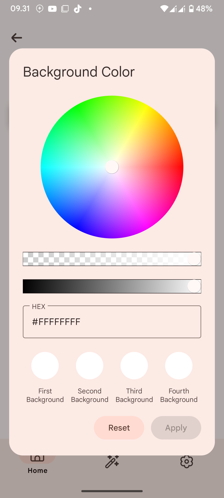</td>
    <td>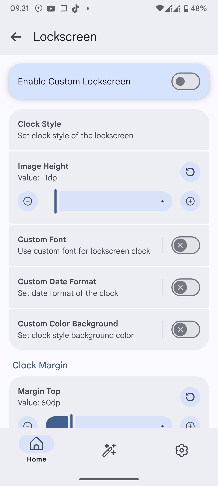</td>
    <td>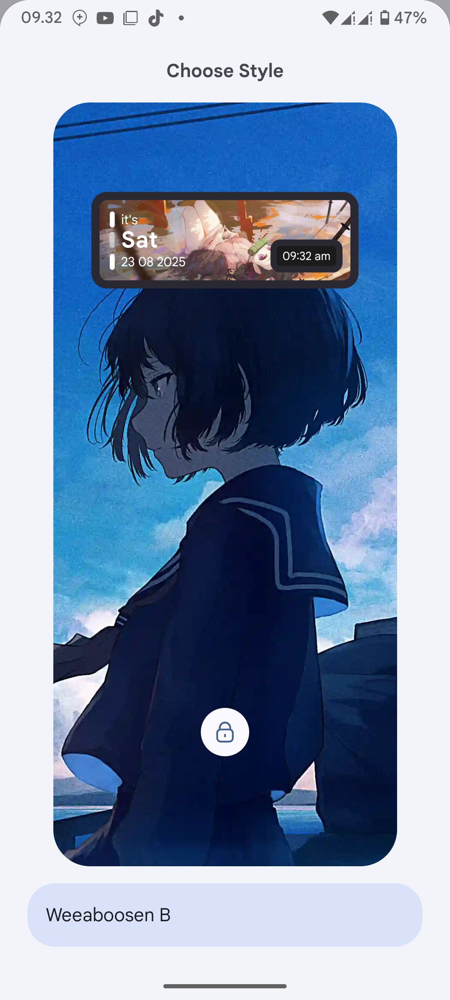</td>
  </tr>
</table>

<!-- Row 3 -->
<table>
  <tr>
    <td>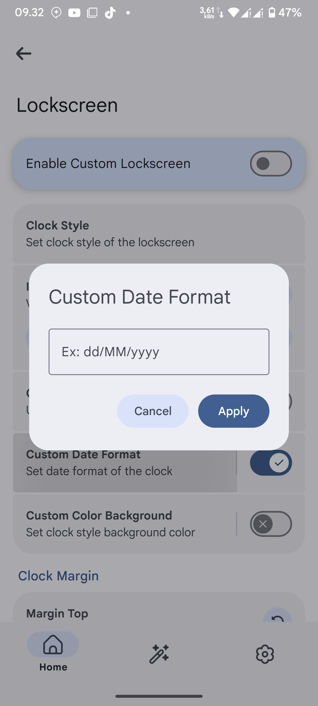</td>
    <td>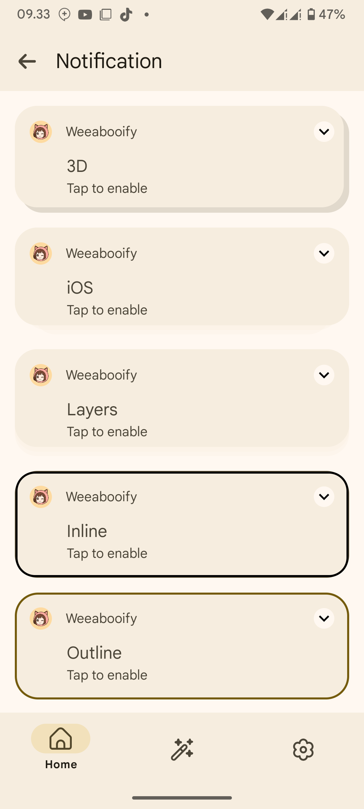</td>
    <td>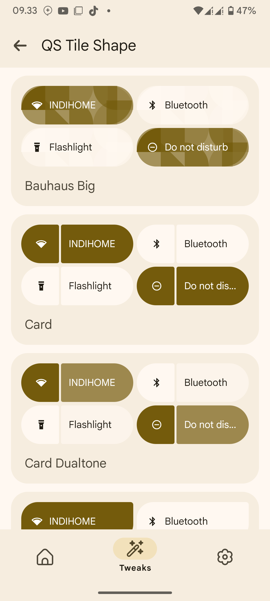</td>
    <td>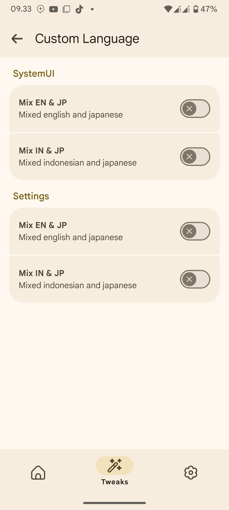</td>
  </tr>
</table>

<!-- Row 4 -->
<table>
  <tr>
    <td>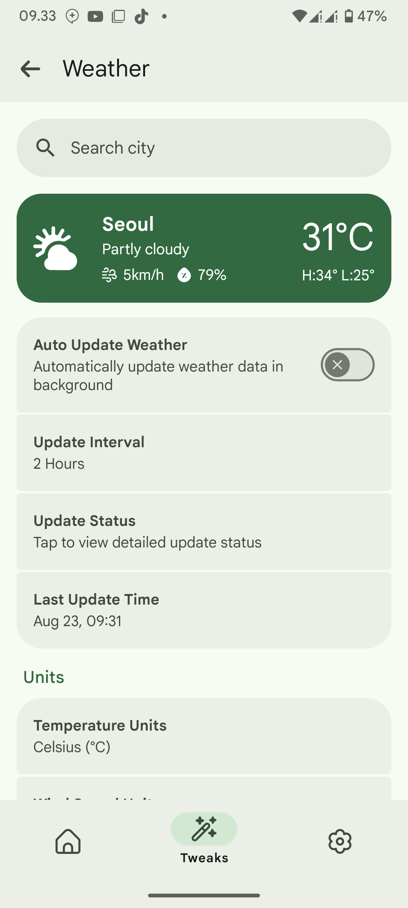</td>
    <td>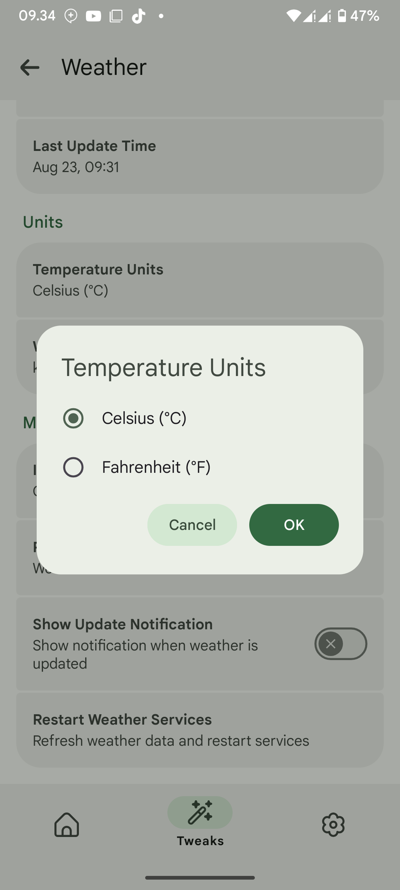</td>
    <td>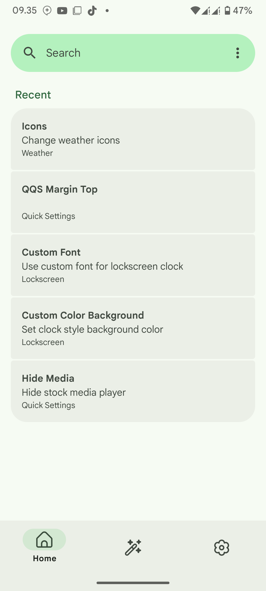</td>
    <td>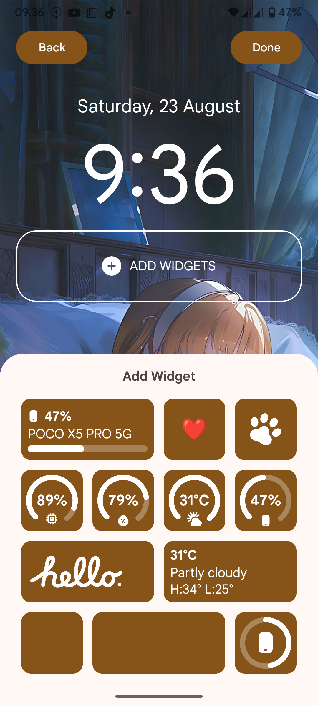</td>
  </tr>
</table>

<!-- Row 5 -->
<table>
  <tr>
    <td>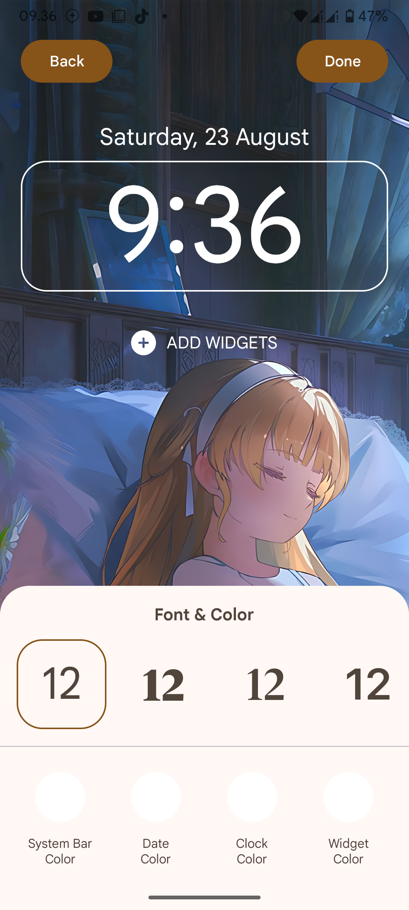</td>
    <td>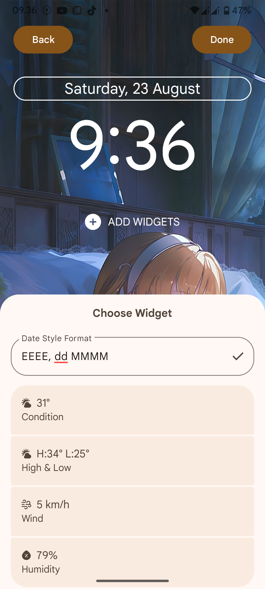</td>
    <td>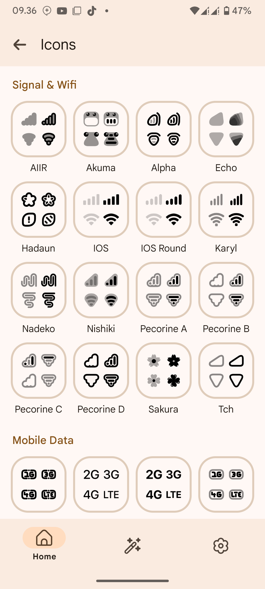</td>
    <td>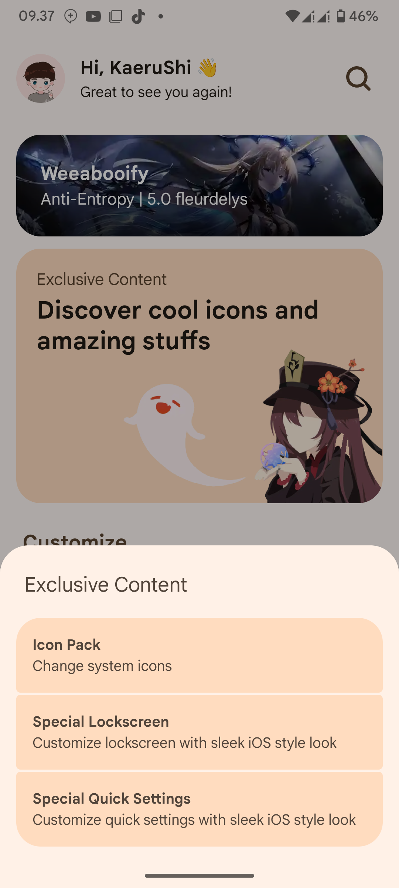</td>
  </tr>
</table>

