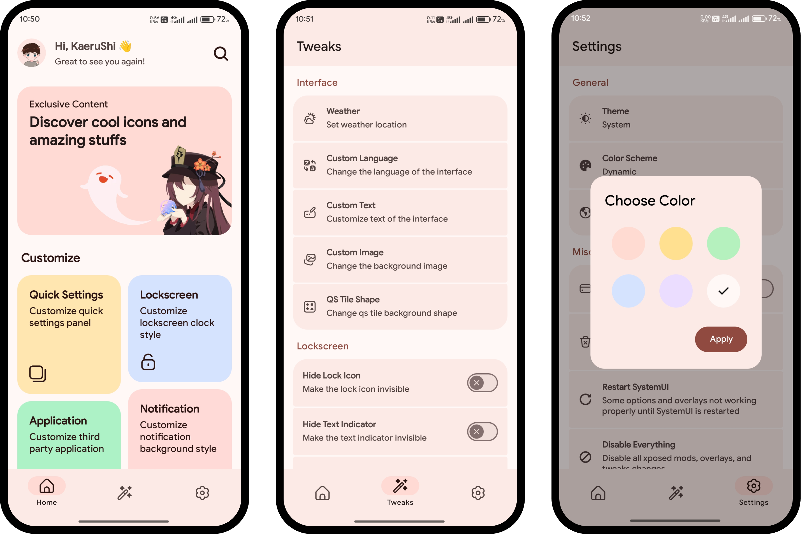

# 🌸 Weeabooify
### Beautiful & Aesthetic Theme Engine for Android

Weeabooify is a powerful theme engine that allows you to easily customize your Android user interface — including QS panel, lockscreen, icons, and more — with a beautiful and aesthetic touch.

## ✨ Features
- Customize QS panel  
- Custom lockscreen interface  
- Icon packs, QS tile shapes, and notification backgrounds  
- SystemUI tweaks  
- And many more...  
> [!Note]
> You can check all features [here](FEATURES-AE.md)

## 🧰 Requirements
- Android 12+ (AOSP-based ROMs only).  
- [Magisk](https://github.com/topjohnwu/Magisk) (recommended) or [KernelSU](https://github.com/tiann/KernelSU).  
- [LSPosed](https://github.com/JingMatrix/LSPosed) *(optionally with [ZygiskNext](https://github.com/Dr-TSNG/ZygiskNext/releases/latest) if required).*  
- Custom recovery with decryption support *(recommended as a fallback in case of bootloop).*  

## 🛠️ Installation
1. Install the **Weeabooify** app.  
2. Open **LSPosed** and enable Weeabooify.  
3. Select **SystemUI** and **Framework**.  
4. Go back to module list → long press **Weeabooify** → select **Re-optimize**.  
5. Open **Weeabooify**, grant all permissions, then log in to your account.  
6. Wait for the installation to finish → reboot your device → enjoy 🎉  

> [!Note]  
> For KernelSU users: root access must be manually enabled via the **KernelSU** app.

## ❤️ Credits
Special thanks to:
- [Android Open Source Project (AOSP)](https://source.android.com) — Android source code  
- [Substratum](https://github.com/substratum/substratum) — Overlay engine references  
- [@DrDisagree](https://github.com/Mahmud0808) — Backend implementation support  

## ⬇️ Download
Weeabooify is available for a **one-time purchase of $5**.  
Support development and unlock all features via the following platforms:

- [Ko-Fi](https://ko-fi.com/s/52b3fa4d26)  
- [Patreon](https://www.patreon.com/KaeruShi/shop/weeabooify-18447?source=storefront)  
- [PayPal](https://paypal.me/kaerushi)  
- e-Wallet & Bank transfer *(contact [@KaeruShi](https://t.me/kaerushi))*  

## 🤔 FAQ

📱 Is my device supported?

- Weeabooify supports **Pixel devices** and **AOSP-based custom ROMs**.  
- Not supported: OEM ROMs such as MIUI, OneUI, OxygenOS, ColorOS, iOS, etc.  

🔨 How to fix bootloop/BSOD?

- Boot into **Safe Mode** or  
- Delete the Weeabooify module from `data/adb/modules/` via custom recovery.  

🌐 What is AE?

- **AE (Anti-Entropy)** is one of the Weeabooify variants.  
- Two available variants:  
  - **Anti-Entropy** → for Android 12+  
  - **Schicksal** → for Android 10 (Substratum)  
- Each variant is sold separately.  

🖼️ Where can I see previews?

- You can check the preview showcase on our **Telegram channel**: [t.me/weeabooify](https://t.me/weeabooify)  

💵 I already paid, what should I do next?

- Contact me on Telegram: [t.me/kaerushi](https://t.me/kaerushi)  
- Send your **payment screenshot** as proof  
- You will then receive installation access/instructions  

